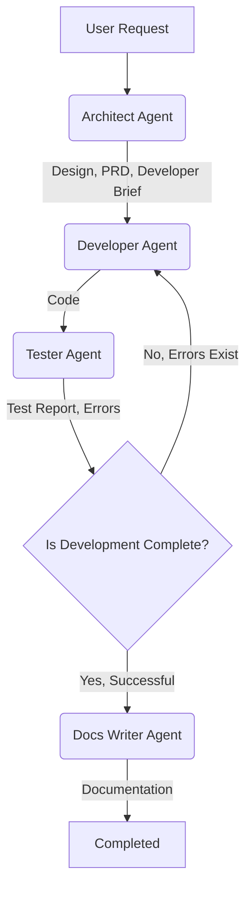

# Multi-Agent Workflow

This project utilizes a multi-agent architecture to automate and manage complex development processes. Each agent has a specific role and set of responsibilities and collaborates during different phases of the project. Below, the roles, responsibilities, and interactions of the agents are described.

## Agents and Their Roles

1.  **Architect Agent (Senior Software Architect)**: Designs the overall technical architecture of the project, creates Product Requirements Documents (PRD), and prepares developer briefs.
2.  **Developer Agent (Senior Python Developer)**: Writes all Python code according to the design specified by the Architect and integrates existing code into the LangGraph architecture.
3.  **Tester Agent (QA Engineer)**: Writes test scenarios for the code written by the Developer, runs tests, identifies bugs, and reports them.
4.  **Docs Writer Agent (Technical Writer)**: Writes all technical and user documentation for the project; produces READMEs, workflow explanations, and agent documentation.

## Workflow

The workflow between agents typically has a cyclical and iterative structure. When an agent completes a task, it passes its output to the next relevant agent.

### Detailed Agent Interaction Flow

1.  **Initiation (User Request)**:
    -   The user makes a request for a new feature, bug fix, or a general project task.
    -   This request is typically handled by the `Architect Agent`.

2.  **Architect Agent Phase**:
    -   The `Architect Agent` analyzes the user request and the current project context (code, `session_state.json`).
    -   Designs or updates the overall technical architecture of the project.
    -   Creates documents such as `product_prd.md` (Product Requirements Document) and `developer_brief.md` (Developer Brief).
    -   **Output**: `product_prd.md`, `developer_brief.md`.
    -   **Next Step**: Passes the design documents to the `Developer Agent`.

3.  **Developer Agent Phase**:
    -   The `Developer Agent` reads the `product_prd.md` and `developer_brief.md` documents received from the `Architect Agent`.
    -   Analyzes the existing code and undertakes tasks for LangGraph architecture integration or new feature development.
    -   Writes or modifies the necessary Python code (files under the `langgraph_crawler/` directory, `main.py` updates).
    -   Manages dependencies (`requirements.txt`) and performs static code checks.
    -   **Output**: Updated/new Python code files, `requirements.txt`.
    -   **Next Step**: Provides the code to be tested to the `Tester Agent`.

4.  **Tester Agent Phase**:
    -   The `Tester Agent` reads the code from the `Developer Agent` and the `product_prd.md`.
    -   Writes unit, integration, and smoke test scenarios for the code (under the `tests/` directory).
    -   Runs the written tests and analyzes the results.
    -   Creates a detailed `test_report.md` containing identified errors and deficiencies.
    -   **Output**: Test files under the `tests/` directory, `test_report.md`.
    -   **Decision Point**:
        -   If critical errors are found in the tests (if `test_report.md` status is `FAILED`), feedback is sent to the `Developer Agent`, and code correction is requested. This initiates an iteration loop.
        -   If tests are successful (if `test_report.md` status is `PASSED`), the project proceeds to the `Docs Writer Agent`.

5.  **Docs Writer Agent Phase**:
    -   The `Docs Writer Agent` reads the entire project context (code, PRD, test reports, outputs from other agents).
    -   Writes the general project documentation (`readme.md`, `multi_agent_workflow.md`, `recommendation.md`) and the documentation for each agent (`agents/*.md`).
    -   Includes findings and recommendations from the test report in `recommendation.md`.
    -   **Output**: `readme.md`, `multi_agent_workflow.md`, `recommendation.md`, `agents/architect_agent.md`, `agents/developer_agent.md`, `agents/tester_agent.md`, `agents/docs_writer_agent.md`.
    -   **Outcome**: Project documentation is completed.

This workflow aims to make the development process more efficient, organized, and fault-tolerant by allowing each agent to focus on its area of expertise.
